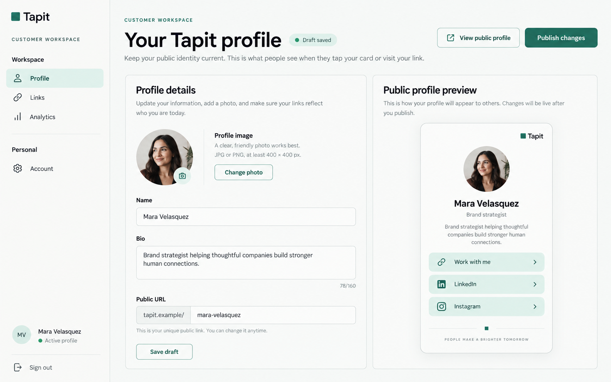

# Authenticated Workspace Sidebar Navigation Implementation Plan

> **For agentic workers:** REQUIRED SUB-SKILL: Use superpowers:subagent-driven-development (recommended) or superpowers:executing-plans to implement this plan task-by-task. Steps use checkbox (`- [ ]`) syntax for tracking.

**Goal:** Replace the authenticated customer and administrator top navigation with a responsive, accessible sidebar shell while preserving every existing route, active-state rule, draft-save guard, authentication boundary, and sign-out behavior.

**Architecture:** Keep `AppShell` as the shared authenticated layout, but move navigation rendering into a focused `SidebarNav` component with shared typed navigation metadata. On large screens the sidebar is persistent and occupies a fixed left rail; below the large breakpoint it becomes a compact header plus an accessible drawer. Customer and administrator shells provide role-specific grouped navigation and footer content without changing their auth or data flows.

**Tech Stack:** Next.js 16.3.5, React 19.3.0, TypeScript 5.9.3, Tailwind CSS 4.3.3, Phosphor Icons 2.1.10, Vitest, Testing Library, Playwright, axe-core.

**Spec:** `docs/DESIGN.md`, the existing authenticated shell contracts in `src/components/layout/AppShell.tsx`, `src/components/layout/CustomerShell.tsx`, and `src/components/layout/AdminShell.tsx`, plus the approved visual reference embedded below.

## Global Constraints

- Preserve the existing customer routes: `/app/profile`, `/app/links`, `/app/account/build-card`, `/app/analytics`, and `/app/account`.
- Preserve the existing administrator routes: `/admin/customers`, `/admin/profiles`, `/admin/cards`, `/admin/analytics`, `/admin/audit-log`, and `/admin/settings`.
- Preserve the longest-prefix active-route match so `/app/account/build-card` activates `Build card` rather than `Account`.
- Preserve `beforeNavigate` and its draft-save-before-routing behavior for the customer workspace.
- Preserve role redirects, demo/live authentication behavior, publication/privacy rules, and the customer exclusion of an administrator `Cards` navigation item.
- Do not change `PublicHeader`, visitor-facing navigation, Convex functions, schemas, or authentication APIs.
- Do not add a new UI dependency; reuse the installed `@phosphor-icons/react` package and the existing Tapit color tokens.
- Keep interactive controls at least 44px high, retain visible `:focus-visible` indicators, and support keyboard activation and Escape dismissal for the mobile drawer.
- Match the approved prototype’s visual direction: warm off-white paper surface, near-black ink, restrained deep emerald accent, pale mint active state, thin borders, generous whitespace, and no gradients or glassmorphism.
- Run the repository’s existing formatting, lint, typecheck, unit, production-build, accessibility, and demo-browser checks before declaring the implementation complete.

## Approved Visual Reference

This is the approved direction for the authenticated customer workspace. It is a visual reference, not an instruction to copy the generated sample data or to change product content. The implementation must retain the current `Build card` route even though the prototype emphasizes the primary workspace destinations.



Reference asset: [2026-09-23-tapit-sidebar-prototype.png](./assets/2026-09-23-tapit-sidebar-prototype.png)

The implementation should preserve these observable qualities:

- A left rail with the Tapit mark, an uppercase workspace eyebrow, grouped links, and a bottom identity/sign-out area.
- A pale mint rounded active item with an emerald icon and `aria-current="page"`.
- A wide content canvas that keeps page-specific forms and previews unchanged.
- A compact mobile header with a menu button that opens the same navigation as a drawer.
- The existing `Build card` destination remains available between `Links` and `Analytics` in the customer workspace.

## File Map

The implementation should touch only the following product files and tests:

- Create `src/components/layout/navigation.ts` for `ShellNavItem` and `ShellNavGroup` contracts shared by the shell and sidebar.
- Create `src/components/layout/SidebarNav.tsx` for desktop sidebar rendering, mobile header/drawer behavior, grouped links, active state, and keyboard-accessible dismissal.
- Modify `src/components/ui/Icon.tsx` to register the navigation icons used by both role-specific shells.
- Modify `src/components/layout/AppShell.tsx` to use `SidebarNav`, preserve active-route calculation and draft-save interception, and expose sidebar footer/mobile-action slots.
- Modify `src/components/layout/CustomerShell.tsx` to provide grouped customer navigation and move sign-out/customer identity content into the sidebar footer.
- Modify `src/components/layout/AdminShell.tsx` to provide grouped administrator navigation and move sign-out/administrator identity content into the sidebar footer.
- Create `tests/unit/sidebar-nav.test.tsx` for isolated navigation rendering and mobile drawer behavior.
- Modify `tests/unit/draft-save-context.test.tsx` for shared-shell active-route and draft-save regressions after the layout change.
- Modify `e2e/customer.spec.ts` for desktop sidebar, mobile drawer, nested `Build card`, and customer route coverage.
- Modify `e2e/admin.spec.ts` for administrator sidebar coverage without changing the existing operations assertions.
- Modify `e2e/accessibility.spec.ts` for the responsive authenticated navigation states.

---

### Task 1: Define shared navigation contracts and the sidebar primitive

**Files:**

- Create: `src/components/layout/navigation.ts`
- Create: `src/components/layout/SidebarNav.tsx`
- Modify: `src/components/ui/Icon.tsx`
- Test: `tests/unit/sidebar-nav.test.tsx`

**Interfaces:**

- `navigation.ts` produces:

```ts
import type { IconName } from "../ui/Icon";

export type ShellNavItem = {
  href: string;
  label: string;
  icon: IconName;
};

export type ShellNavGroup = {
  label: string;
  items: ShellNavItem[];
};
```

- `SidebarNav.tsx` consumes `ShellNavGroup[]`, the currently active href, the shell title, a navigation click handler, optional mobile actions, and a footer node. It produces the persistent desktop rail and the mobile menu button/drawer without owning routing or auth.

- Keep the navigation callback signature compatible with `AppShell`:

```ts
onNavigate: (event: MouseEvent<HTMLAnchorElement>, href: string) => void;
```

- Extend `IconName` with the installed Phosphor icons needed by the two shells: `user`, `link`, `card`, `chart`, `gear`, `users`, `profiles`, `audit`, and `settings`, while keeping `fingerprint` unchanged for `Brand`.

- [ ] **Step 1: Write the failing isolated sidebar tests**

Add `tests/unit/sidebar-nav.test.tsx` with the existing Vitest and Testing Library conventions. Mock `next/link` as an anchor and render `SidebarNav` with two groups:

```tsx
const groups = [
  {
    label: "Workspace",
    items: [
      { href: "/app/profile", label: "Profile", icon: "user" as const },
      { href: "/app/links", label: "Links", icon: "link" as const },
    ],
  },
  {
    label: "Personal",
    items: [{ href: "/app/account", label: "Account", icon: "gear" as const }],
  },
];
```

Assert that the sidebar exposes a navigation landmark named `Workspace navigation`, renders both group labels, marks only `/app/profile` with `aria-current="page"`, renders the icon-bearing links, and renders the supplied footer.

Add a mobile interaction test that clicks `Open navigation`, expects `aria-expanded="true"`, finds the drawer navigation, clicks `Close navigation`, and expects `aria-expanded="false"`.

- [ ] **Step 2: Run the new test to verify it fails**

Run:

```bash
npm test -- tests/unit/sidebar-nav.test.tsx
```

Expected: FAIL because `navigation.ts`, `SidebarNav.tsx`, and the requested icon names do not yet exist.

- [ ] **Step 3: Add the contracts and icon registry**

Create `navigation.ts` with the exact types above. In `Icon.tsx`, import the corresponding Phosphor icon components, add them to the `icons` map, and keep the existing `Icon` implementation so every icon remains `aria-hidden` by default.

- [ ] **Step 4: Implement the isolated sidebar behavior**

Create `SidebarNav.tsx` with these rules:

1. Render a desktop `<aside>` at `lg` and above with a vertical border, Tapit `Brand`, grouped `<nav>`, and footer.
2. Render a mobile header below `lg` with the Tapit brand, the supplied mobile actions, and a `button` labeled `Open navigation` with `aria-expanded` and `aria-controls`.
3. Render the mobile drawer only when open. Give it a stable id, a navigation landmark named from the shell title, a `Close navigation` button, and a backdrop button that also closes it.
4. Close the drawer after an internal navigation click and when the user presses Escape. Do not close it for modified clicks or external navigation.
5. Render each item as a normal Next `Link`, use `aria-current="page"` only for the matching item, and use the shared `Icon` with a decorative label-adjacent icon.
6. Keep the footer in both desktop and mobile navigation surfaces so sign-out remains reachable without a top navbar.
7. Use the existing `tapit-paper`, `tapit-surface`, `tapit-line`, `tapit-ink`, `tapit-muted`, `tapit-accent`, and `tapit-accent-soft` tokens. Do not add gradients, shadows that obscure borders, or new CSS dependencies.

- [ ] **Step 5: Run the isolated tests to verify they pass**

Run:

```bash
npm test -- tests/unit/sidebar-nav.test.tsx
```

Expected: PASS with the grouped links, active state, footer, and mobile open/close assertions passing.

- [ ] **Step 6: Commit the primitive**

```bash
git add src/components/layout/navigation.ts src/components/layout/SidebarNav.tsx src/components/ui/Icon.tsx tests/unit/sidebar-nav.test.tsx
git commit -m "feat: add responsive sidebar navigation primitive"
```

### Task 2: Integrate the sidebar into the shared authenticated shell

**Files:**

- Modify: `src/components/layout/AppShell.tsx`
- Test: `tests/unit/draft-save-context.test.tsx`

**Interfaces:**

- `AppShell` consumes `ShellNavGroup[]` instead of a flat `ShellNavItem[]` and accepts:

```ts
type AppShellProps = {
  children: ReactNode;
  eyebrow: string;
  mobileHeaderActions?: ReactNode;
  sidebarFooter?: ReactNode;
  navGroups: ShellNavGroup[];
  beforeNavigate?: (href: string) => Promise<boolean>;
  showPageIntro?: boolean;
  title: string;
};
```

- `AppShell` produces the same `activeHref` longest-prefix behavior and the same `handleNavigation` draft-save behavior, but delegates navigation visuals to `SidebarNav`.

- [ ] **Step 1: Update the shell unit tests to specify the new contract**

Update the existing `AppShell` renders in `tests/unit/draft-save-context.test.tsx` from `navItems` to `navGroups`. Keep the nested-route test and add an assertion that `/app/account/build-card` activates only `Build card` when both items are present:

```tsx
expect(screen.getByRole("link", { name: "Build card" })).toHaveAttribute("aria-current", "page");
expect(screen.getByRole("link", { name: "Account" })).not.toHaveAttribute("aria-current", "page");
```

Keep the existing deferred-save, rejected-save, modified-click, and external-link cases unchanged in meaning.

- [ ] **Step 2: Run the shell tests to verify they fail**

Run:

```bash
npm test -- tests/unit/draft-save-context.test.tsx
```

Expected: FAIL because `AppShell` still expects the old flat navigation prop and does not render `SidebarNav`.

- [ ] **Step 3: Integrate `SidebarNav` without changing routing semantics**

In `AppShell.tsx`:

1. Import `ShellNavGroup` and `SidebarNav`.
2. Compute `activeHref` by flattening `navGroups`, filtering exact or descendant matches, and sorting by href length descending exactly as the current implementation does.
3. Keep the current `handleNavigation` guard for non-left clicks, modifier keys, cross-origin links, and failed draft saves.
4. Render `SidebarNav` once with the computed active href and callback.
5. Replace the current top header with the sidebar/mobile-header output while leaving the page intro and `children` rendering intact.
6. Keep `showPageIntro={false}` working for the customer workspace.
7. Ensure the main content has a responsive left offset/grid supplied by the shell rather than by individual page components.

- [ ] **Step 4: Run the shell tests to verify they pass**

Run:

```bash
npm test -- tests/unit/draft-save-context.test.tsx
```

Expected: PASS, including active nested-route selection and all draft-save navigation cases.

- [ ] **Step 5: Commit the shell integration**

```bash
git add src/components/layout/AppShell.tsx tests/unit/draft-save-context.test.tsx
git commit -m "refactor: integrate sidebar into authenticated app shell"
```

### Task 3: Wire the customer workspace to the approved sidebar hierarchy

**Files:**

- Modify: `src/components/layout/CustomerShell.tsx`
- Test: `e2e/customer.spec.ts`

**Interfaces:**

- `CustomerShell` produces this grouped navigation metadata without changing route paths:

```ts
const customerNavGroups: ShellNavGroup[] = [
  {
    label: "Workspace",
    items: [
      { href: "/app/profile", label: "Profile", icon: "user" },
      { href: "/app/links", label: "Links", icon: "link" },
      { href: "/app/account/build-card", label: "Build card", icon: "card" },
      { href: "/app/analytics", label: "Analytics", icon: "chart" },
    ],
  },
  {
    label: "Personal",
    items: [{ href: "/app/account", label: "Account", icon: "gear" }],
  },
];
```

- The demo and live shells both pass the same `customerNavGroups`, use `beforeNavigate={draftSave}`, and provide sign-out as `sidebarFooter`. The footer may show the available demo customer identity or live customer workspace label, but it must not introduce a new customer query or auth dependency.

- [ ] **Step 1: Add customer sidebar assertions to the browser test**

After `signInAsCustomer(page)` in `e2e/customer.spec.ts`, assert that the grouped sidebar navigation and each existing customer route are visible. Preserve the existing assertion that `Cards` is absent. Add a mobile case:

```ts
await page.setViewportSize({ width: 390, height: 844 });
await page.goto("/app/profile");
await expect(page.getByRole("button", { name: "Open navigation" })).toBeVisible();
await page.getByRole("button", { name: "Open navigation" }).click();
await expect(page.getByRole("navigation", { name: /Your Tapit profile navigation/ })).toBeVisible();
await page.getByRole("link", { name: "Build card", exact: true }).click();
await expect(page).toHaveURL(/\/app\/account\/build-card$/);
await expect(page.getByRole("button", { name: "Open navigation" })).toHaveAttribute(
  "aria-expanded",
  "false",
);
```

- [ ] **Step 2: Run the customer browser test to verify it fails**

Run:

```bash
npm run test:e2e:demo -- e2e/customer.spec.ts --workers=1
```

Expected: FAIL because the current customer shell still renders a horizontal header navigation and does not expose the new mobile drawer controls.

- [ ] **Step 3: Replace the flat customer navigation with grouped metadata**

Update both demo and live customer shell branches to pass `navGroups={customerNavGroups}`. Move the current `Sign out` button into `sidebarFooter` and retain its exact demo/live action: clear the demo session then route to `/login` in demo mode, and call `signOut().finally(() => router.replace("/login"))` in live mode. Pass any small mobile-only action through `mobileHeaderActions` only if it is needed for the compact header.

Do not remove `Build card`; the prototype is a visual reference and the route is an existing customer capability.

- [ ] **Step 4: Run the customer browser test to verify it passes**

Run:

```bash
npm run test:e2e:demo -- e2e/customer.spec.ts --workers=1
```

Expected: PASS for customer sign-in, setup, nested Build card routing, private drafts, and the responsive sidebar assertions.

- [ ] **Step 5: Commit the customer shell wiring**

```bash
git add src/components/layout/CustomerShell.tsx e2e/customer.spec.ts
git commit -m "feat: move customer workspace navigation to sidebar"
```

### Task 4: Wire the administrator console to the same responsive shell

**Files:**

- Modify: `src/components/layout/AdminShell.tsx`
- Test: `e2e/admin.spec.ts`

**Interfaces:**

- `AdminShell` produces this grouped navigation metadata:

```ts
const adminNavGroups: ShellNavGroup[] = [
  {
    label: "Operations",
    items: [
      { href: "/admin/customers", label: "Customers", icon: "users" },
      { href: "/admin/profiles", label: "Profiles", icon: "profiles" },
      { href: "/admin/cards", label: "Cards", icon: "card" },
      { href: "/admin/analytics", label: "Analytics", icon: "chart" },
    ],
  },
  {
    label: "Governance",
    items: [
      { href: "/admin/audit-log", label: "Audit log", icon: "audit" },
      { href: "/admin/settings", label: "Settings", icon: "settings" },
    ],
  },
];
```

- Both demo and live admin shells pass `navGroups={adminNavGroups}` and move their current sign-out action into `sidebarFooter`. The existing “Signed in as”/“Administrator workspace” context remains available in the footer or page content; no auth logic moves into `SidebarNav`.

- [ ] **Step 1: Add administrator responsive navigation assertions**

After `signInAsAdmin(page)` in `e2e/admin.spec.ts`, assert the Operations and Governance links are visible and add a mobile check that opens the drawer and navigates to Cards:

```ts
await page.setViewportSize({ width: 390, height: 844 });
await page.goto("/admin/customers");
await page.getByRole("button", { name: "Open navigation" }).click();
await expect(page.getByRole("link", { name: "Audit log", exact: true })).toBeVisible();
await page.getByRole("link", { name: "Cards", exact: true }).click();
await expect(page).toHaveURL(/\/admin\/cards$/);
```

- [ ] **Step 2: Run the administrator browser tests to verify they fail**

Run:

```bash
npm run test:e2e:demo -- e2e/admin.spec.ts --workers=1
```

Expected: FAIL only at the new sidebar/drawer assertions while the existing customer, card, moderation, and deletion behavior remains covered.

- [ ] **Step 3: Replace the flat administrator navigation and relocate sign-out**

Update both admin shell branches to pass `adminNavGroups`. Remove the duplicate sign-out row rendered above `{children}` because the sidebar footer now owns that action. Keep the existing page content and all demo/live redirect branches unchanged.

- [ ] **Step 4: Run the administrator browser tests to verify they pass**

Run:

```bash
npm run test:e2e:demo -- e2e/admin.spec.ts --workers=1
```

Expected: PASS for all existing administrator operations plus the desktop and mobile sidebar assertions.

- [ ] **Step 5: Commit the administrator shell wiring**

```bash
git add src/components/layout/AdminShell.tsx e2e/admin.spec.ts
git commit -m "feat: move administrator navigation to sidebar"
```

### Task 5: Certify keyboard, responsive, and accessibility behavior

**Files:**

- Modify: `tests/unit/sidebar-nav.test.tsx`
- Modify: `tests/unit/draft-save-context.test.tsx`
- Modify: `e2e/customer.spec.ts`
- Modify: `e2e/admin.spec.ts`
- Modify: `e2e/accessibility.spec.ts`

**Interfaces:**

- The final shell must expose one navigation landmark per visible navigation surface, a keyboard-operable drawer, a stable active link, and no horizontal overflow at the documented phone width.

- [ ] **Step 1: Add keyboard and route-preservation unit coverage**

In `tests/unit/sidebar-nav.test.tsx`, add assertions that:

```tsx
const toggle = screen.getByRole("button", { name: "Open navigation" });
toggle.focus();
fireEvent.keyDown(toggle, { key: "Enter" });
expect(toggle).toHaveAttribute("aria-expanded", "true");

fireEvent.keyDown(document, { key: "Escape" });
expect(toggle).toHaveAttribute("aria-expanded", "false");
```

Also verify that clicking a link calls `onNavigate` with the original event and href, and that `aria-current` remains limited to the longest matching destination.

- [ ] **Step 2: Add mobile overflow and focus assertions to browser coverage**

In the customer and administrator browser tests, after opening and closing the drawer at `390x844`, assert:

```ts
expect(await page.evaluate(() => document.documentElement.scrollWidth)).toBeLessThanOrEqual(390);
await expect(page.getByRole("button", { name: "Open navigation" })).toBeFocused();
```

Use the actual close path supported by the implementation—Escape and the close button—and verify focus returns to the open-navigation button after dismissal.

- [ ] **Step 3: Extend axe checks to the authenticated drawer state**

In `e2e/accessibility.spec.ts`, keep the existing customer and administrator desktop checks. Add a customer mobile check that signs in, sets the viewport to `390x844`, opens the drawer, runs the existing `expectNoA11yViolations(page)` helper, closes the drawer, and verifies the page remains violation-free. Add the same drawer-state check for the administrator workspace.

- [ ] **Step 4: Run focused unit and browser checks**

Run serially:

```bash
npm test -- tests/unit/sidebar-nav.test.tsx tests/unit/draft-save-context.test.tsx
npm run test:e2e:demo -- e2e/customer.spec.ts e2e/admin.spec.ts e2e/accessibility.spec.ts --workers=1
```

Expected: PASS with no horizontal overflow, no duplicate visible navigation landmarks, correct focus restoration, and zero axe violations.

- [ ] **Step 5: Commit the responsive certification coverage**

```bash
git add tests/unit/sidebar-nav.test.tsx tests/unit/draft-save-context.test.tsx e2e/customer.spec.ts e2e/admin.spec.ts e2e/accessibility.spec.ts
git commit -m "test: cover responsive sidebar accessibility"
```

### Task 6: Perform final visual and repository verification

**Files:**

- Verify: `docs/plans/assets/2026-09-23-tapit-sidebar-prototype.png`
- Verify: all files listed above

**Interfaces:**

- The finished implementation is accepted only when behavior and visual review agree with the approved prototype and the existing authenticated flows remain green.

- [ ] **Step 1: Review the three required viewport states against the prototype**

Run the demo app and inspect these authenticated routes manually at `390x844`, `768px` wide, and `1440px` wide:

```text
/app/profile
/app/links
/app/account/build-card
/app/analytics
/app/account
/admin/customers
/admin/cards
/admin/audit-log
```

At `1440px`, confirm the persistent left rail, grouped links, pale mint active state, footer sign-out, and wide content canvas match the reference image. At `390px`, confirm the compact header, drawer, close behavior, and unchanged page content. At `768px`, confirm the transition does not create horizontal scroll or clipped form controls.

- [ ] **Step 2: Run repository verification**

Run the existing checks serially because Next-backed commands share generated build output:

```bash
npm run format:check
npm run lint
npm run typecheck
npm test
npm run build
npm run test:e2e:demo -- --workers=1
git diff --check
```

Expected: every command exits successfully; the generated prototype asset remains tracked only at `docs/plans/assets/2026-09-23-tapit-sidebar-prototype.png`; no unrelated files are modified.

- [ ] **Step 3: Commit only if final verification changes tests or formatting**

```bash
git status --short
git diff --check
```

If the verification commands changed formatting in files owned by this feature, review the diff and commit only those files:

```bash
git add src/components/layout src/components/ui/Icon.tsx tests/unit/sidebar-nav.test.tsx tests/unit/draft-save-context.test.tsx e2e/customer.spec.ts e2e/admin.spec.ts e2e/accessibility.spec.ts docs/plans/assets/2026-09-23-tapit-sidebar-prototype.png
git commit -m "chore: finalize sidebar navigation verification"
```

If no files changed, do not create an empty commit.

## Self-Review Checklist

- The approved prototype is embedded and linked from the plan.
- Customer and administrator route inventories are complete, including the current customer `Build card` route.
- The shared active-route and draft-save behaviors have explicit tests.
- Demo/live auth and sign-out semantics remain owned by their existing shells.
- Public visitor navigation is explicitly outside scope.
- Desktop, tablet, mobile, keyboard, focus, Escape dismissal, overflow, and axe behavior are covered.
- No new dependency or backend change is required.
- All plan steps contain concrete files, commands, expected outcomes, and commit boundaries.
